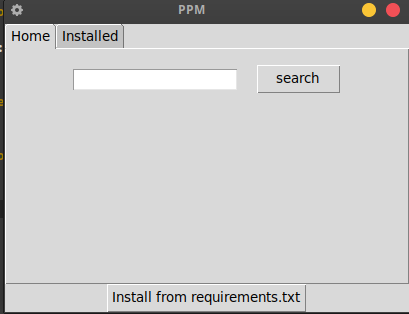
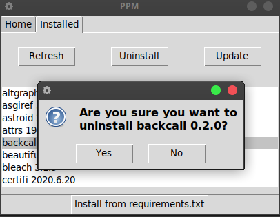
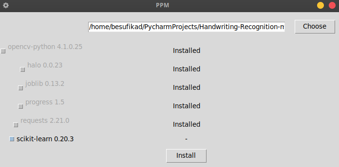
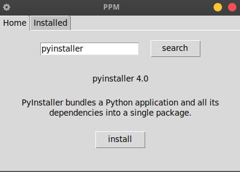

# PPM

Tested on both Python 3.6.7 and Python 3.7.4

UI based python desktop application for installing, uninstalling and updating python packages. 

## Requirements
 * Python > 3.0 
 * <a href="">Activestate tcl (for linux and mac)</a>
    
## Installation
 
```buildoutcfg
   git clone https://github.com/Besufikad17/PPM.git
```

## Screenshots






